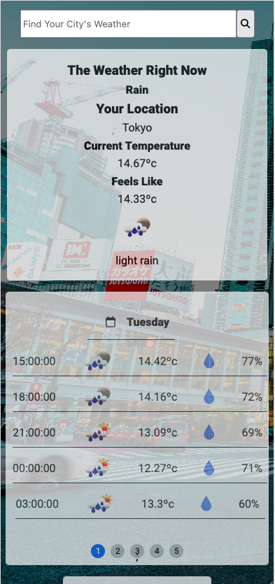

# Frontend Mentor - Fullstack Weather Dashboard

A Fullstack web application using React JS for the front end with Node JS and Express JS for the backend.

## Table of contents

- [Overview](#overview)
  - [What I found Challenging](#What-I-found-Challenging)
  - [Screenshot](#screenshot)
  - [Links](#links)
- [My process](#my-process)
  - [Built with](#built-with)
  - [What I learned](#what-i-learned)
  - [Continued development](#continued-development)
  - [What I would do differently next time.](#What-I-would-do-differently-next-time.)
- [Author](#author)

## Overview

This is is my first full stack web application. It is my own version of a weather app that I created from scratch without a tutorial. It uses React JS for the front end with Node JS and Express JS for the back end. It combines several API calls to achieve a few features. Its main feature of course is to tell you the current weather. Though in addition it tells you your current local time and gives you a five day weather forecast. In addition the background image is set dynamically to match your location (if permission is granted) and to wherever you chose to search.

### What I found Challenging

There were quite a few challenges as this was my first fullstack application independent of any tutorial. Here are the few I found:
- Learning how to use React UseState to update the state of data via UseEffect and the fetch API.
- Learning how to send data from the front end to the backend and vice versa
- Dealing with CORS for hosting the project online.

### Screenshot

### Links

- Solution URL: [Add solution URL here](https://github.com/zach7815/faq-accordian-FEM)
- Live Site URL: [Add live site URL here](https://your-live-site-url.com)
- Link to Backend files: [Add live site URL here](https://your-live-site-url.com)
- Link to Fullstack files: [Add live site URL here](https://your-live-site-url.com)

## My process

For this project I did a quite a bit of planning and thinking how I would build the application. The first thing I did was do a rough pen and paper wire frame then a more comprehensive design. I used Adobe XD to model what the application would look like and prototype some of the interactions (you can see the designs in the design folder of this project). I then started constructing the Front end of the project with React. To make it easier for later I also tested displaying dummy data and tested an array of objects with array values being passed down the component tree in preparation for API calls.

Next I worked on the backend and ensuring I passed requests from the frontend to backend and back successfully. Finally I worked on ensuring the backend extracted only the required data needed before sending it back to the front end for displaying.

### Built with

- React JS
- Swiper JS
- Node JS
- Express JS
- Unsplash, OpenCage and OpenWeather Free API's
- Asynchronous programming

### What I learned

For this project I learned a lot. This is my first real react project that I did independently so I learned a great about the different hooks that React offers and how to use them, Though I mainly only needed UseState, UseEffect and UseRef.

In addition, I also learned a great deal about Node and Express JS and how to pass data from the front end to back end and vice versa. I also learnt and used quite a few new libraries/ APIs so I got better at reading and using different documentation to implement new features. Finally, this project made me feel a lot more confident with using the fetch protocol and asynchronous programming and promises in general.

### Continued development

For my next project I am going to attempt a digital internship based on React that uses classes instead of functional components. This is because while functional components may be more used now and in the future, I will most likely at some point need to deal with legacy React code that uses class components.

I also plan to build more full stack applications in the future. I will seek to incorporate a database in the next one as well as the ability for people to login in as a user via third part authentication such as Facebook or Google to login.

### What I would do differently next time.
If was to do this project again I would probably add a couple of features and edit some of the ones I currently have. I would add some loading animations to make it clearer to the user that something is occuring on the page loading. In addition, I would also set a default location to be generated if the user doesn't give permission to use location.

For the features I would edit, I would change the resolution of the images being called by Unsplash API for the background. As the images are rather large in file size right now which slows the loading of the page. I did try using the smaller images provided but they became blurry. So for this I would need to look into image compression to ensure that the file size is smaller.

In addition I would also change either how I process the five day forecast api or possibly display something else. This is because the way the API data is called and parsed now causes issues in some days weather information overlapping. For example if you click on Sunday, it may display some of Saturdays times and weather. This is because the of how the API works in providing data.

